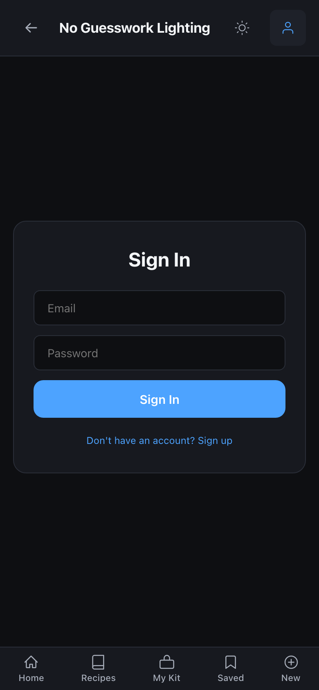

# NGW Lab User Guide

How to use NGW Lab for image analysis, gold set curation, rule candidate management, and engine updates.

---

## What Is NGW Lab

NGW Lab is an internal development tool for improving the NGW lighting analysis engine. It provides:

- **Workbench** -- Run the full analysis pipeline on any image and inspect every layer of output.
- **Gold Set** -- Curate a collection of reference images with verified ground truth, then batch-evaluate the engine against them.
- **Rule Candidates** -- Track proposed engine changes through a structured workflow from discovery to implementation.

Lab is designed for developers and domain experts who need to evaluate engine accuracy, identify misclassifications, and systematically improve the lighting rules.

---

## Getting Access

Lab access requires three things:

### 1. Server-side email whitelist

The `NGW_DEV_EMAILS` environment variable controls who can access Lab endpoints. Set it to a comma-separated list of allowed email addresses:

```bash
# In your .env or shell profile
export NGW_DEV_EMAILS="alice@example.com,bob@example.com"
```

The guard is **fail-closed** -- if `NGW_DEV_EMAILS` is empty or unset, all Lab requests return `403 Forbidden`, even for authenticated users.

Implementation: `auth/dev_guard.py` wraps the standard `get_current_user` dependency with an additional email check.

### 2. Enable the feature flag

Lab mode is hidden by default. There are three ways to enable it -- no browser console required:

**Auto-enable (recommended):** Simply sign in with a whitelisted email. The app probes `/api/lab/status` on login and on page load. If the server returns 200, the `enable_lab` flag is set automatically.

**URL parameter:** Visit the app with `?lab=1` appended to the URL. The flag is set and the parameter is cleaned from the URL:

```
https://your-app-url/?lab=1
```

**Secret logo tap:** On the welcome screen, tap the NGW logo 5 times within 3 seconds to toggle Lab mode on or off. This works like Android's developer options unlock.

**Manual (browser console):** Still available as a fallback:

```js
localStorage.setItem('ngw_feature_flags', JSON.stringify({
  ...JSON.parse(localStorage.getItem('ngw_feature_flags') || '{}'),
  enable_lab: true
}));
location.reload();
```

### 3. Sign in

Lab mode only appears on the welcome screen when you are signed in with an account whose email is in the whitelist. The mode card appears in a separate "Dev Tools" section below the main mode grid.



### Verifying Access

Once conditions are met, you can verify by calling the status endpoint:

```
GET /api/lab/status
Authorization: Bearer <your-jwt>
```

A successful response looks like:

```json
{
  "status": "ok",
  "user": "your-email@example.com",
  "lab_version": "0.1.0"
}
```

---

## Workbench

The Workbench runs the full NGW analysis pipeline on a single image and returns all intermediate outputs for inspection. This is the primary tool for understanding exactly what the engine sees.

### What it does

1. Uploads your image to `data/uploads/lab/`
2. Runs `describe_image()` (VLM layer) to get a natural-language description
3. Runs `build_reference_photo_analysis()` to produce the structured 3-layer output

### The 3-Layer Output

| Layer | What it contains |
|-------|-----------------|
| **ImageRead** | Raw VLM description: what the model sees in the photo (lighting cues, subject, environment, mood) |
| **LightingRead** | Structured lighting analysis: pattern classification, key/fill ratios, modifier identification, shadow behavior |
| **RecreationSetup** | Actionable setup: light placements, modifiers, camera settings, power hints, test steps |

### Using the Workbench

**Via the API:**

```bash
curl -X POST /api/lab/analyze \
  -H "Authorization: Bearer $TOKEN" \
  -F "image=@photo.jpg"
```

**Via the UI:**

1. Open Lab mode from the welcome screen (requires sign-in + feature flag)
2. Select the **Workbench** tab
3. Tap **Select Image** and choose a photo
4. Tap **Analyze** to run the full pipeline
5. Toggle between **Formatted** view (structured sections for Narrative, Lighting, Recreation Setup) and **Raw JSON** view
6. Tap **New Image** to reset and analyze another photo

The Workbench shows a scan animation while the pipeline runs, then displays results in collapsible sections matching the 3-layer output structure.

### What to look for

- Does the **pattern classification** match what you see in the image?
- Are the **catchlight positions** correctly identified?
- Does the **modifier identification** make sense given the light quality?
- Are the **camera settings** reasonable for the lighting conditions?
- Does the **shadow behavior** description match the actual shadows?

When you find a discrepancy, that's a candidate for the Gold Set.

---

## Gold Set

The Gold Set is a curated collection of reference images with verified, human-reviewed ground truth. It serves as the engine's regression test suite -- you can batch-evaluate the engine against all approved entries to check for regressions or improvements.

### Status Lifecycle

```
draft  -->  approved  -->  archived
  ^                          |
  |__________________________|
```

| Status | Meaning |
|--------|---------|
| `draft` | Entry created, ground truth not yet verified. Under review. |
| `approved` | Ground truth verified by a human expert. Included in batch evaluations. |
| `archived` | Retired from active evaluation. Kept for historical reference. |

### Creating an Entry

**Via the API:**

```bash
curl -X POST /api/lab/gold-set \
  -H "Authorization: Bearer $TOKEN" \
  -H "Content-Type: application/json" \
  -d '{
    "image_path": "/path/to/reference/image.jpg",
    "expected_analysis": {
      "mood": "dramatic",
      "pattern": "rembrandt",
      "key_position": "45deg camera-left",
      "modifier": "gridded softbox"
    },
    "notes": "Classic Rembrandt with visible triangle on shadow side",
    "status": "draft"
  }'
```

**Via the UI:**

1. Select the **Gold Set** tab
2. Use the status filter chips (All / Draft / Approved / Archived) to browse entries
3. Tap **+ New** to open the create form -- fill in the image path, optional notes, and expected analysis JSON
4. Tap any entry card to open the detail view with full metadata and expected analysis
5. Use the status controls in the detail view: **Approve** (draft), **Archive** (approved), or **Reopen as Draft** (archived)
6. Tap **Run Eval** in the toolbar to batch-evaluate all approved entries -- results appear in a banner with pass/fail counts and a JSON inspector

### Typical workflow

1. **Discover** -- Use the Workbench to analyze an image where you notice a misclassification.
2. **Create draft** -- Add the image to the Gold Set with the correct expected analysis as a draft.
3. **Verify** -- Have a second person review the expected analysis values.
4. **Approve** -- Update status to `approved` once ground truth is confirmed.
5. **Evaluate** -- Run batch evaluation to see how the engine performs against all approved entries.

### Batch Evaluation

Run the engine against all approved Gold Set entries at once:

```bash
curl -X POST "/api/lab/gold-set/evaluate?limit=100" \
  -H "Authorization: Bearer $TOKEN"
```

The response contains per-entry results with both `expected` and `actual` analysis, letting you compare them:

```json
{
  "evaluated": 42,
  "results": [
    {
      "entry_id": "abc123",
      "image_path": "/path/to/image.jpg",
      "status": "analyzed",
      "expected": { "mood": "dramatic", "pattern": "rembrandt" },
      "actual": { "...full analysis output..." }
    }
  ],
  "evaluated_by": "dev@example.com",
  "evaluated_at": 1710000000.0
}
```

Entries whose image files are missing are returned with `"status": "skipped"`. Entries that cause pipeline errors are returned with `"status": "error"`.

---

## Rule Candidates

When you identify an engine issue through Workbench analysis or Gold Set evaluation, create a Rule Candidate to track the proposed fix through a structured workflow.

### Status Workflow

```
proposed  -->  accepted  -->  implemented
    |
    +-------->  rejected
```

| Status | Meaning |
|--------|---------|
| `proposed` | Issue identified, fix proposed. Under review. |
| `accepted` | Team agrees the fix is correct. Ready for implementation. |
| `rejected` | Proposal reviewed and declined (with rationale). |
| `implemented` | Code change has been made and verified. |

### Creating a Candidate

```bash
curl -X POST /api/lab/candidates \
  -H "Authorization: Bearer $TOKEN" \
  -H "Content-Type: application/json" \
  -d '{
    "title": "Triangle pattern misclassified as clamshell",
    "description": "Hurley-style 3-light triangle setup classified as clamshell because patterns.py lacks a triangle pattern check.",
    "rationale": "Catchlights clearly show 3 lights in triangle formation. Engine has no triangle pattern, defaults to clamshell.",
    "source_gold_set_id": "abc123",
    "proposed_change": {
      "file": "engine/patterns.py",
      "action": "Add triangle pattern before clamshell check",
      "details": "Check for headshot + triangle/symmetric/dual key keywords"
    },
    "status": "proposed"
  }'
```

**Via the UI:**

1. Select the **Candidates** tab
2. Use the status filter chips (All / Proposed / Accepted / Rejected / Implemented) to browse
3. Tap **+ New** to create a candidate -- fill in title, description, rationale, optional source gold set ID, and proposed change JSON
4. Tap any candidate card to open the detail view
5. Use the status workflow controls: **Accept** or **Reject** (proposed), **Mark Implemented** (accepted), **Reopen** (rejected)
6. Each candidate tracks its creation date and can link back to the gold set entry that exposed the issue

### Fields

| Field | Required | Description |
|-------|----------|-------------|
| `title` | Yes | Short description of the issue |
| `description` | Yes | Full explanation of what's wrong |
| `rationale` | No | Why the proposed fix is correct |
| `source_gold_set_id` | No | Link to the Gold Set entry that exposed the issue |
| `proposed_change` | No | JSON describing the proposed code change |
| `status` | No | Initial status (defaults to `proposed`) |

---

## Lab API Reference

All endpoints are prefixed with `/api/lab` and require a valid JWT from a whitelisted dev email.

### Status

| Method | Path | Description |
|--------|------|-------------|
| `GET` | `/lab/status` | Check dev access. Returns `200` if authorized. |

### Workbench

| Method | Path | Description |
|--------|------|-------------|
| `POST` | `/lab/analyze` | Upload an image (multipart form) and run full pipeline analysis. |

### Gold Set

| Method | Path | Description |
|--------|------|-------------|
| `GET` | `/lab/gold-set` | List entries. Optional query params: `status`, `limit`. |
| `GET` | `/lab/gold-set/{id}` | Get a single entry by ID. |
| `POST` | `/lab/gold-set` | Create a new entry (JSON body). |
| `PUT` | `/lab/gold-set/{id}` | Update an entry (JSON body, partial updates). |
| `DELETE` | `/lab/gold-set/{id}` | Delete an entry. |
| `POST` | `/lab/gold-set/evaluate` | Batch-evaluate all approved entries. Optional: `limit`. |

### Rule Candidates

| Method | Path | Description |
|--------|------|-------------|
| `GET` | `/lab/candidates` | List candidates. Optional query params: `status`, `limit`. |
| `GET` | `/lab/candidates/{id}` | Get a single candidate by ID. |
| `POST` | `/lab/candidates` | Create a new candidate (JSON body). |
| `PUT` | `/lab/candidates/{id}` | Update a candidate (JSON body, partial updates). |
| `DELETE` | `/lab/candidates/{id}` | Delete a candidate. |

---

## Engine Update Workflow

This is the end-to-end process for discovering, documenting, and fixing an engine issue using Lab tools and the CORRECTIONS.md log.

### Step 1: Discover the Issue

Use the **Workbench** to analyze an image where you suspect the engine is wrong. Compare the output against what you know the correct analysis should be.

Common things to check:
- Lighting pattern classification
- Key light position and modifier identification
- Shadow behavior and fill ratio
- Catchlight count and placement
- Camera setting recommendations

### Step 2: Add to Gold Set

Create a Gold Set entry with the image and the **correct** expected analysis. Start it as `draft`:

```bash
curl -X POST /api/lab/gold-set \
  -H "Authorization: Bearer $TOKEN" \
  -H "Content-Type: application/json" \
  -d '{
    "image_path": "/path/to/image.jpg",
    "expected_analysis": { "pattern": "triangle", "mood": "headshot" },
    "notes": "Hurley-style triangle catchlights, engine says clamshell",
    "status": "draft"
  }'
```

### Step 3: Verify and Approve

Have the ground truth reviewed. Once confirmed, promote to `approved`:

```bash
curl -X PUT /api/lab/gold-set/{entry_id} \
  -H "Authorization: Bearer $TOKEN" \
  -H "Content-Type: application/json" \
  -d '{"status": "approved"}'
```

### Step 4: Create a Rule Candidate

Document the proposed fix as a rule candidate, linking it to the gold set entry:

```bash
curl -X POST /api/lab/candidates \
  -H "Authorization: Bearer $TOKEN" \
  -H "Content-Type: application/json" \
  -d '{
    "title": "Add triangle pattern recognition",
    "description": "Engine lacks triangle pattern, misclassifies as clamshell",
    "source_gold_set_id": "<entry_id>",
    "proposed_change": {
      "file": "engine/patterns.py",
      "action": "Add triangle classification block"
    }
  }'
```

### Step 5: Log the Correction

Add the detailed correction to `CORRECTIONS.md` at the project root, following the established template:

```markdown
## YYYY-MM-DD -- [Brief Description]

### Problem
[What was misdiagnosed and why]

### Reference
[What the correct setup actually is]

### Correction N of N: [Which file]
[Exact code change with context]
```

See the existing Triangle Lighting Pattern correction in CORRECTIONS.md for a complete example.

### Step 6: Implement the Fix

Apply the code changes described in the correction. Use Claude Code for systematic application:

```
Read CORRECTIONS.md. Implement the latest correction.
One change per message, diff only, max 150 lines. READY FOR NEXT.
```

### Step 7: Re-evaluate

Run batch evaluation against the Gold Set to verify the fix and check for regressions:

```bash
curl -X POST "/api/lab/gold-set/evaluate?limit=200" \
  -H "Authorization: Bearer $TOKEN"
```

Check that:
- The previously failing entry now produces the correct analysis
- No other approved entries have regressed

### Step 8: Update Statuses

Mark the rule candidate as `implemented` and optionally archive old gold set entries that are no longer needed for active testing:

```bash
# Mark candidate as implemented
curl -X PUT /api/lab/candidates/{candidate_id} \
  -H "Authorization: Bearer $TOKEN" \
  -H "Content-Type: application/json" \
  -d '{"status": "implemented"}'
```

---

## CORRECTIONS.md Integration

The `CORRECTIONS.md` file at the project root is the canonical record of all engine corrections. Lab tools help you discover issues and track them, but the actual fix details always go into CORRECTIONS.md.

### Relationship between Lab and CORRECTIONS.md

| Tool | Purpose |
|------|---------|
| **Workbench** | Discover the issue (analyze images, inspect outputs) |
| **Gold Set** | Document the ground truth (what the correct answer should be) |
| **Rule Candidates** | Track the fix proposal (status, rationale, which files change) |
| **CORRECTIONS.md** | Record the exact code change (file, line, before/after) |

Lab is the discovery and tracking system. CORRECTIONS.md is the implementation record. Together they form a complete audit trail from issue discovery through resolution.

---

## File Map

| File | Purpose |
|------|---------|
| `auth/dev_guard.py` | Email whitelist guard (`get_dev_user` dependency) |
| `api/routes/lab.py` | All Lab REST endpoints |
| `db/database.py` | Gold Set + Rule Candidate table schemas and CRUD functions |
| `ui/src/screens/LabScreen.jsx` | Lab UI (Workbench, Gold Set, Candidates tabs) |
| `ui/src/data/labApi.js` | Frontend API client for Lab endpoints |
| `ui/src/modes/modeRegistry.js` | Lab mode definition in `APP_MODES` |
| `ui/src/modes/featureFlags.js` | `enable_lab` flag (default: false) |
| `CORRECTIONS.md` | Lighting corrections log with fix details |
