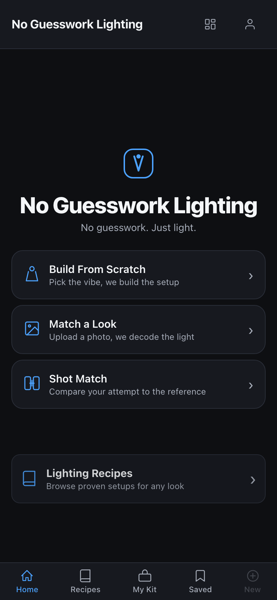
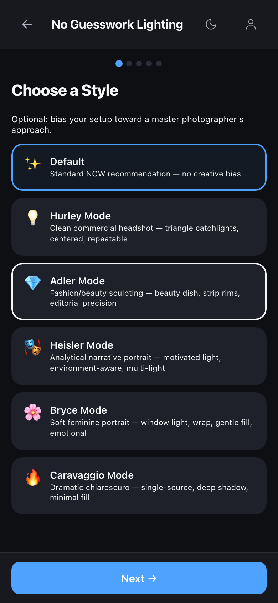
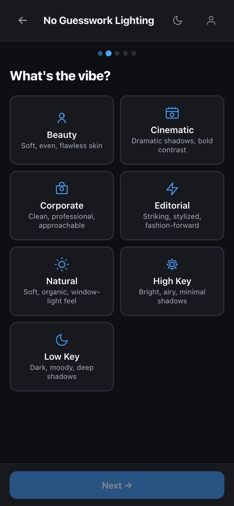
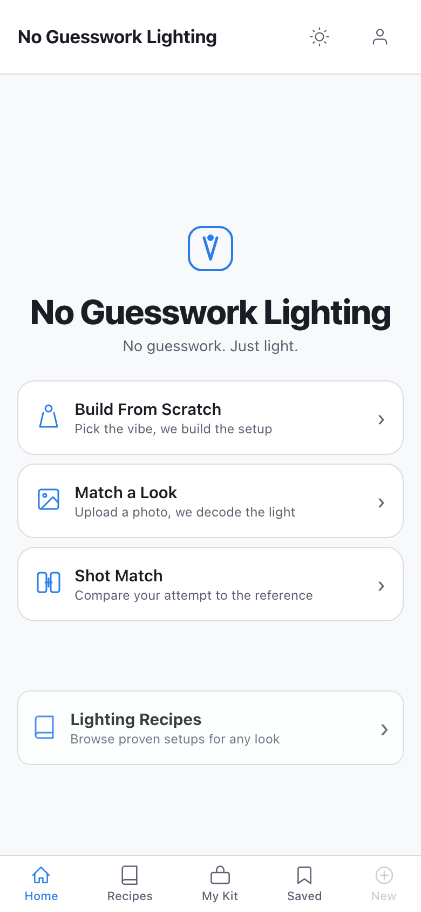
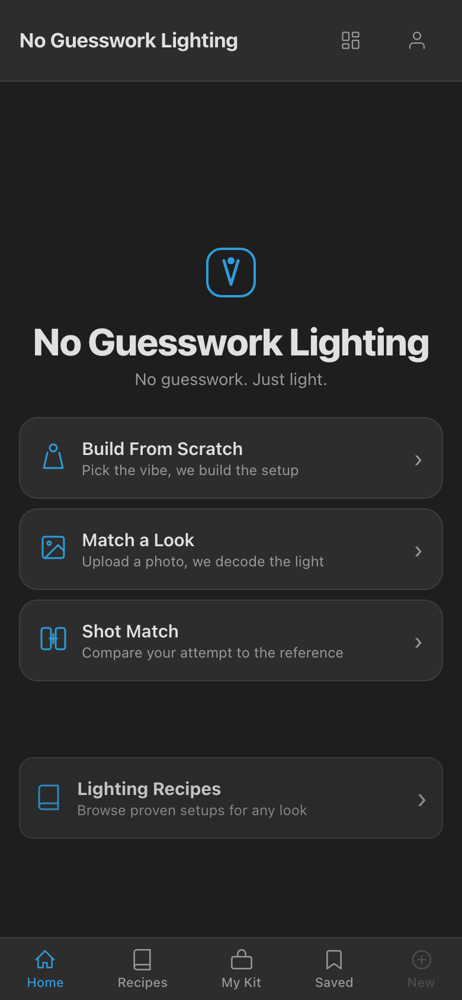
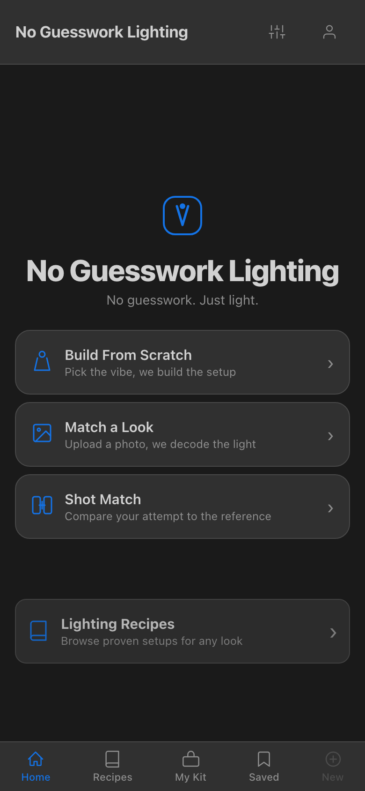
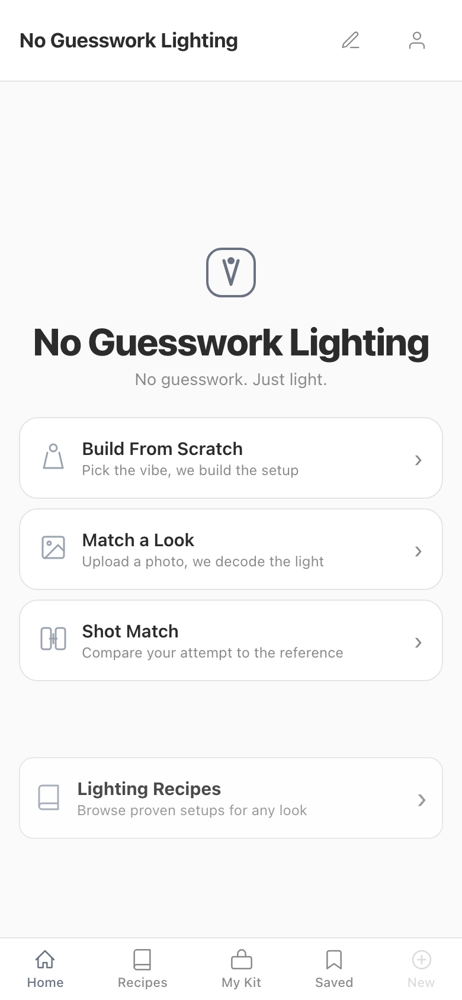

# NGW Mode Architecture

How the app organizes its features into discrete modes, how to configure them, and how to add new ones.

---

## Overview

NGW uses a **mode system** to separate its core capabilities into distinct user-facing experiences. Each mode has its own entry point, wizard steps, result CTAs, and access control. Modes are defined centrally in a single registry and rendered dynamically on the home screen.

There are currently **5 modes** plus a cross-cutting **master mode** system that biases recommendations toward a photographer's style.



### At a Glance

| Mode | Purpose | Access |
|------|---------|--------|
| **Build From Scratch** | Pick a mood, walk through the wizard, get a full lighting setup | Public |
| **Match a Look** | Upload a reference photo, decode the lighting, get recreation instructions | Public |
| **Shot Match** | Compare your attempt photo against a reference side-by-side | Public (flag-gated) |
| **Shoot Mode** | On-set assistant with checklist, quick fixes, and verification | Public (requires result) |
| **NGW Lab** | Internal dev tools: workbench, gold set, rule candidates | Admin (flag-gated) |

---

## Mode Registry

All modes are defined in `ui/src/modes/modeRegistry.js` as the `APP_MODES` object. Each mode entry has the following shape:

```js
{
  id:            string,       // unique key, e.g. 'build', 'match', 'lab'
  label:         string,       // display name on mode card
  tagline:       string,       // subtitle shown under the label
  icon:          string,       // icon key ('lightbulb', 'camera', 'compare', 'target', 'beaker')
  access:        'public' | 'admin',  // who can see the mode card
  featureFlag:   string | null,       // flag key in featureFlags.js (null = always enabled)
  entryAction:   'wizard' | 'upload' | 'screen',  // what happens when the user taps the card
  entryScreen:   string | null,       // direct screen to navigate to (for 'screen' and 'upload' actions)
  wizardSteps:   string[],            // ordered step ids for the wizard flow
  resultCTAs:    string[],            // mode ids shown as CTAs on the results screen
  requiresResult: boolean,            // if true, mode is only accessible when a result exists
}
```

### Field Definitions

- **`id`** -- Unique identifier used in state management (`appMode`) and routing logic.
- **`label`** / **`tagline`** -- Human-readable text displayed on the `ModeCard` component on the welcome screen.
- **`icon`** -- Key passed to `ModeIcon` which renders the appropriate SVG.
- **`access`** -- `'public'` modes appear in the main mode grid. `'admin'` modes appear in a separate section, only when the user is signed in and the mode's feature flag is enabled.
- **`featureFlag`** -- When set, the mode is only available if this flag evaluates to `true` via `isModeEnabled()`. When `null`, the mode is always available.
- **`entryAction`** -- Determines what happens when the mode card is tapped:
  - `'wizard'` -- Sets intent and starts the wizard flow with the mode's `wizardSteps`.
  - `'upload'` -- Navigates directly to `entryScreen` (used by Match a Look to go to the upload/eval screen).
  - `'screen'` -- Navigates directly to `entryScreen` (used by Shoot Mode, Shot Match, Lab).
- **`entryScreen`** -- The screen key (from `App.jsx` SCREENS dict) to navigate to. Only used when `entryAction` is `'upload'` or `'screen'`.
- **`wizardSteps`** -- Array of step identifiers that `SetupWizard` renders in order. Common steps: `'master_mode'`, `'mood'`, `'subject'`, `'environment'`, `'gear_question'`, `'gear_entry'`.
- **`resultCTAs`** -- After the engine returns a result, these mode ids are shown as action buttons on the results screen (e.g., "Open in Shoot Mode", "Compare My Attempt").
- **`requiresResult`** -- When `true`, the mode can only be entered from a results screen (it won't appear on the welcome screen as a standalone card). Shoot Mode uses this because it needs setup data to display.

---

## Mode Reference

### Build From Scratch (`build`)

The primary flow. User picks a mood/vibe, answers questions about subject type, environment, and gear, then receives a complete lighting setup recommendation.

- Entry: wizard with steps `['mood', 'subject', 'environment', 'gear_question']`
- Result CTAs: Shoot Mode
- Feature flag: none (always on)





### Match a Look (`match`)

User uploads one or more reference photos. The engine analyzes the lighting in the photo and generates recreation instructions. After analysis, the user continues through a shortened wizard to provide context (subject, environment, gear).

- Entry: upload screen (`ref_eval`)
- Wizard steps: `['subject', 'environment', 'gear_question']`
- Result CTAs: Shoot Mode, Shot Match
- Feature flag: none (always on)

### Shot Match (`shot_match`)

Side-by-side comparison tool. User uploads their attempt photo alongside the reference, and the system compares across 6 dimensions: light direction, source hardness, contrast, background separation, shadow pattern, specular behavior.

- Entry: direct screen (`shot_match`)
- Feature flag: `enable_shot_match` (default: `true`)

### Shoot Mode (`shoot`)

Mobile-first on-set assistant. Shows the full setup summary, individual light placements, camera settings, a step-by-step test checklist, "what to look for" signs, and quick fixes. Designed to be used at the shoot location.

- Entry: direct screen (`shoot_mode`)
- Requires: an existing result (can only be reached from results screen CTA)
- Result CTAs: Shot Match

### NGW Lab (`lab`)

Internal development tools. Three-tab interface: Workbench (full-pipeline image analysis), Gold Set (curated reference images with verified ground truth), and Rule Candidates (proposed engine changes). Accessible only to whitelisted dev accounts.

- Entry: direct screen (`lab`)
- Feature flag: `enable_lab` (default: `false`)
- Access: `admin` (requires sign-in + dev email whitelist)

See [Lab User Guide](lab-guide.md) for full documentation.

---

## Themes

NGW ships with five themes. The toggle in the header cycles through them:

| Theme | Description |
|-------|-------------|
| **Dark** | Deep charcoal with blue accents (default) |
| **Light** | Cool blue-gray with vibrant blue accents |
| **Photoshop** | Adobe Photoshop-inspired dark UI |
| **Lightroom** | Adobe Lightroom-inspired muted blue-gray |
| **DailyNote** | Minimal grayscale, warm off-white, system fonts |

 

 



---

## Feature Flags

Feature flags live in `ui/src/modes/featureFlags.js` and use localStorage for persistence. Defaults are baked into the source code.

### Default Values

| Flag | Default | Controls |
|------|---------|----------|
| `enable_lab` | `false` | NGW Lab mode visibility |
| `enable_shot_match` | `true` | Shot Match mode visibility |
| `enable_master_mode` | `true` | Master mode selector and header badge |
| `enable_reference_compare` | `false` | Reference comparison feature (reserved) |
| `enable_taxonomy_editor` | `false` | Taxonomy editor (reserved) |
| `enable_rule_editor` | `false` | Rule editor (reserved) |

### Toggling Flags at Runtime

Open your browser console and run:

```js
// Import the flag setter (works in dev tools because of module scope)
// Or use the global helper if exposed:

// Enable Lab mode
localStorage.setItem('ngw_feature_flags', JSON.stringify({
  ...JSON.parse(localStorage.getItem('ngw_feature_flags') || '{}'),
  enable_lab: true
}));

// Then reload the page
location.reload();
```

### How Flags Gate Modes

```
isModeEnabled(mode)
  -> if mode.featureFlag is null -> always true
  -> else -> isEnabled(mode.featureFlag) -> checks merged defaults + localStorage
```

The welcome screen calls `isModeEnabled()` when filtering which mode cards to display. Admin modes additionally require the user to be signed in.

---

## Master Modes

Master modes are a **cross-cutting** style preference that biases the engine's recommendations toward a specific photographer's approach. They are independent of the app mode (Build, Match, etc.) and persist across sessions.

### Available Styles

| ID | Label | Icon | Style |
|----|-------|------|-------|
| `hurley` | Hurley | `lightbulb` | Clean commercial headshot |
| `adler` | Adler | `gem` | Fashion/beauty sculpting |
| `heisler` | Heisler | `masks` | Narrative portrait |
| `bryce` | Bryce | `flower` | Soft feminine portrait |
| `caravaggio` | Caravaggio | `fire` | Dramatic chiaroscuro |

Setting master mode to `null` returns to the default NGW recommendation with no creative bias.

### How They Work

1. **Wizard step** -- `StepMasterMode` is the first step in the Build From Scratch wizard. Users pick a style (or skip for default).
2. **Header badge** -- When a master mode is active and `enable_master_mode` is true, a badge appears in the app header showing the active style icon and label. Tapping it opens the `MasterModeSelector` overlay.
3. **Persistence** -- The selected master mode is stored in `localStorage` under `ngw_master_mode`. It survives page reloads and even `RESET` actions.
4. **Quick-change overlay** -- `MasterModeSelector` is a bottom-sheet component that lets users switch styles from anywhere in the app without restarting the wizard.

### Key Files

| File | Purpose |
|------|---------|
| `ui/src/wizard/StepMasterMode.jsx` | Wizard step with full mode cards (labels + taglines) |
| `ui/src/components/MasterModeSelector.jsx` | Header overlay for quick-switching, exports `MASTER_MODE_MAP` |
| `ui/src/context/AppContext.jsx` | `SET_MASTER_MODE` action with localStorage persistence |
| `ui/src/components/AppHeader.jsx` | Badge display + overlay toggle |

---

## Screen Routing

All screens are registered in the `SCREENS` dict in `ui/src/App.jsx`:

```
welcome       -> WelcomeScreen
wizard        -> SetupWizard
loading       -> LoadingScreen
results       -> ResultsScreen
recipes       -> RecipeScreen
my_kit        -> MyKitScreen
saved_setups  -> SavedSetupsScreen
auth          -> AuthScreen
ref_eval      -> ReferenceEvalScreen
shoot_mode    -> ShootModeScreen
shot_match    -> ShotMatchScreen
lab           -> LabScreen
```

Navigation is managed by the `AppContext` reducer:
- `NAVIGATE` -- pushes current screen to history and sets new screen
- `GO_BACK` -- pops history stack
- `SET_INTENT` -- sets screen to `'wizard'` and configures wizard steps
- `SET_LOADING` / `SET_RESULT` -- transitions through loading to results

---

## Adding a New Mode

Follow this checklist to add a new mode to NGW:

### 1. Define the mode in the registry

Add an entry to `APP_MODES` in `ui/src/modes/modeRegistry.js`:

```js
my_new_mode: {
  id: 'my_new_mode',
  label: 'My New Mode',
  tagline: 'Description of what it does',
  icon: 'some_icon',       // add icon to ModeIcon.jsx if needed
  access: 'public',        // or 'admin'
  featureFlag: null,        // or 'enable_my_new_mode'
  entryAction: 'screen',   // or 'wizard' or 'upload'
  entryScreen: 'my_new_screen',
  wizardSteps: [],
  resultCTAs: [],
  requiresResult: false,
},
```

### 2. Add the icon (if new)

If your mode uses a new icon key, add the SVG to `ui/src/components/ModeIcon.jsx`.

### 3. Add a feature flag (if gated)

If `featureFlag` is set, add the default to `DEFAULTS` in `ui/src/modes/featureFlags.js`:

```js
enable_my_new_mode: false,
```

### 4. Create the screen component

Create `ui/src/screens/MyNewScreen.jsx` (or whatever your screen component is).

### 5. Register the screen

Import and add it to the `SCREENS` dict in `ui/src/App.jsx`:

```js
import MyNewScreen from './screens/MyNewScreen';

const SCREENS = {
  // ...existing screens...
  my_new_screen: MyNewScreen,
};
```

### 6. Add wizard steps (if applicable)

If your mode uses `entryAction: 'wizard'`, define the step sequence in `wizardSteps` and make sure each step component exists in `ui/src/wizard/`.

### 7. Wire up CTAs (if applicable)

If your mode should be reachable from another mode's results screen, add its `id` to the source mode's `resultCTAs` array. Then add the CTA button rendering logic in `ResultsScreen.jsx`.

### 8. Add styles

Add CSS for your new screen components to `ui/src/styles/app.css`.

### 9. Verify

```bash
cd ui && npm run build
```

A clean build with no errors confirms the mode is wired correctly.

---

## File Map

| File | Purpose |
|------|---------|
| `ui/src/modes/modeRegistry.js` | Central mode definitions, helpers (`getHomeModes`, `getAdminModes`, etc.) |
| `ui/src/modes/featureFlags.js` | Feature flag defaults, `setFlag()`, `isEnabled()`, `isModeEnabled()` |
| `ui/src/context/AppContext.jsx` | State management: `appMode`, `masterMode`, `SET_APP_MODE`, `SET_MASTER_MODE` |
| `ui/src/App.jsx` | `SCREENS` routing dict |
| `ui/src/screens/WelcomeScreen.jsx` | Home screen with mode cards grid |
| `ui/src/components/ModeCard.jsx` | Individual mode card component |
| `ui/src/components/ModeIcon.jsx` | SVG icon resolver for mode icons |
| `ui/src/screens/SetupWizard.jsx` | Multi-step wizard container |
| `ui/src/wizard/StepMasterMode.jsx` | Master mode selection wizard step |
| `ui/src/components/MasterModeSelector.jsx` | Quick-change master mode overlay |
| `ui/src/components/AppHeader.jsx` | Header with master mode badge |
| `ui/src/screens/ResultsScreen.jsx` | Results display with mode CTA bar |
| `ui/src/screens/ShootModeScreen.jsx` | Shoot Mode on-set assistant |
| `ui/src/screens/ShotMatchScreen.jsx` | Shot Match comparison tool |
| `ui/src/screens/LabScreen.jsx` | NGW Lab three-tab interface |
